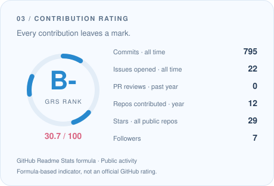
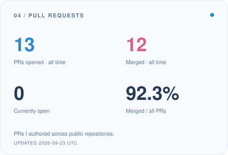

  

  <strong>English</strong> · <a href="./README_ZH_HANS.md">简体中文</a>

  <a href="https://ariakage.com">Website</a> &nbsp; / &nbsp;
  <a href="./resume.md">Resume</a> &nbsp; / &nbsp;
  <a href="mailto:neohutao233@icloud.com">Email</a> &nbsp; / &nbsp;
  <a href="https://x.com/Ariakage_">𝕏 @Ariakage_</a>

## Hiya, I'm Ariakage. 

> **Pronunciation**: English *Aria* /ˈɑːriə/ + Japanese *kage* /kaɡe/.

**A student developer turning curious ideas into things you can interact with.**

I'm a high school student at **Hangzhou No. 11 High School**, working across full-stack development, AI, and interaction design. I love open source, technology, and equality — and the little details that make software feel more human.

- **Building** · AI companions, Live2D experiences, and tools for everyday creativity.
- **Exploring** · Neuroscience × Computer Science, with a long-term interest in **brain–computer interfaces**.
- **Creating with** · [SRInternet Studio](https://sr-studio.cn), [Gravel Evolution & MoonStone Hackathon](https://moonstone.org.cn), and [_entropy & PolarisHackathon](https://github.com/PolarisHackathon).
- **Away from the keyboard** · Photography, literature, and imagining virtual worlds.

> Code with curiosity. Create with care. Keep a little wonder.

## Selected work

| Project | A small glimpse inside |
| :--- | :--- |
| **[live2d-agent-kit](https://github.com/Ariakage/live2d-agent-kit)** | A Live2D creation workflow for Codex and AI agents, from PSD/PNG rigging to WebGL validation. `Python` `Live2D` |
| **[protein-split-audit](https://github.com/Ariakage/protein-split-audit)** | Auditable protein-classification datasets, similarity-aware splits, and reproducible evaluation. `Python` `Research` |
| **[gpx2track-softui](https://github.com/Ariakage/gpx2track-softui)** | Turn GPX tracks into self-contained, interactive Soft UI pages. `Go` `Visualization` |
| **[PointShift](https://github.com/Ariakage/PointShift)** | A hackathon project built around the theme “Point.” at BuilderUP Hangzhou. `JavaScript` `Hackathon` |

## My creative toolkit

**Web & interfaces**

**AI & backend**

**Systems & making things**

A little more about student life

Student Union · Photography Club · Campus Publicity Team at Hangzhou No. 11 High School.

GitHub Student Developer · JetBrains Student Developer · Tencent Cloud Developer Pioneer · ISIC Student.

More about my experience and projects in my **[resume](./resume.md)**.

## A little activity, a little progress

  <picture>
    <source media="(prefers-color-scheme: dark)" srcset="./assets/generated/overview-dark.svg" />
    
  </picture>
  <picture>
    <source media="(prefers-color-scheme: dark)" srcset="./assets/generated/languages-dark.svg" />
    
  </picture>

  <picture>
    <source media="(prefers-color-scheme: dark)" srcset="./assets/generated/rating-dark.svg" />
    
  </picture>
  <picture>
    <source media="(prefers-color-scheme: dark)" srcset="./assets/generated/pull-requests-dark.svg" />
    
  </picture>

<picture>
  <source media="(prefers-color-scheme: dark) and (max-width: 600px)" srcset="./assets/generated/activity-mobile-dark.svg" />
  <source media="(max-width: 600px)" srcset="./assets/generated/activity-mobile-light.svg" />
  <source media="(prefers-color-scheme: dark)" srcset="./assets/generated/activity-dark.svg" />
  
</picture>

### Follow the little blue snake

<picture>
  <source media="(prefers-color-scheme: dark)" srcset="./assets/generated/snake-dark.svg" />
  
</picture>

  Built from my public GitHub profile · refreshed daily · <a href="./docs/PROFILE.md">How these visuals work</a>

---

  <strong>Let's make something thoughtful.</strong> 
  <a href="mailto:neohutao233@icloud.com">neohutao233@icloud.com</a> · <a href="mailto:ariakage233@gmail.com">ariakage233@gmail.com</a>  
  Thanks for stopping by my little corner of GitHub. 🩵

