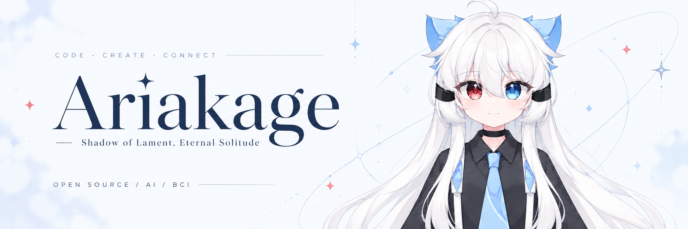
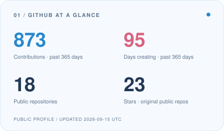
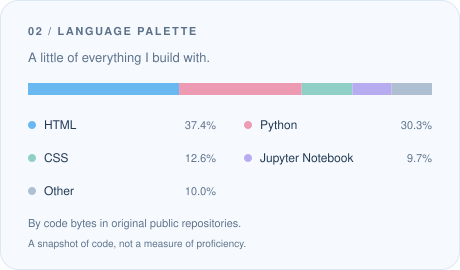
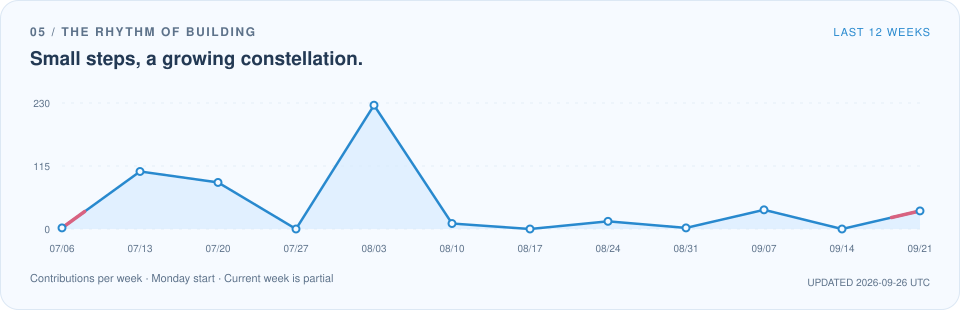

  

  <a href="./README.md">English</a> · <strong>简体中文</strong>

  <a href="https://ariakage.com">个人网站</a> &nbsp; / &nbsp;
  <a href="./resume.md">我的简历</a> &nbsp; / &nbsp;
  <a href="mailto:neohutao233@icloud.com">给我写信</a> &nbsp; / &nbsp;
  <a href="https://x.com/Ariakage_">𝕏 @Ariakage_</a>

## 你好呀，我是 Ariakage 咏影。

**一名学生开发者，把脑海里好奇的念头，变成可以交互的小世界。**

我来自**杭州市第十一中学**，主要探索全栈开发、人工智能与交互设计。热爱开源、科技与平等，也在意那些让软件更有温度的小细节。

- **正在创造** · AI 陪伴、Live2D 互动体验，以及服务日常创作的工具。
- **持续探索** · 神经科学 × 计算机科学，希望未来深入研究**脑机接口（BCI）**。
- **一起做事** · [SRInternet Studio](https://sr-studio.cn)、[Gravel Evolution & MoonStone Hackathon](https://moonstone.org.cn)，以及 [熵序前言 & 极星黑客松](https://github.com/PolarisHackathon)。
- **离开键盘** · 摄影、文学，还有关于虚拟世界的想象。

> 带着好奇写代码，用心创造，留一点浪漫给世界。

## 最近留下的作品

| 项目 | 关于它的一点点介绍 |
| :--- | :--- |
| **[live2d-agent-kit](https://github.com/Ariakage/live2d-agent-kit)** | 面向 Codex 与 AI Agent 的 Live2D 创作流程，从 PSD/PNG 绑定到 WebGL 验证。`Python` `Live2D` |
| **[protein-split-audit](https://github.com/Ariakage/protein-split-audit)** | 让蛋白质分类数据集、相似度感知划分与评估过程可审计、可复现。`Python` `科研` |
| **[gpx2track-softui](https://github.com/Ariakage/gpx2track-softui)** | 把 GPX 轨迹变成一份可以独立打开、交互浏览的 Soft UI 页面。`Go` `可视化` |
| **[PointShift](https://github.com/Ariakage/PointShift)** | 在 BuilderUP 杭州，围绕「Point.」主题完成的黑客松作品。`JavaScript` `黑客松` |

## 我的创作工具箱

**网页与交互**

**AI 与后端**

**系统与创作**

再展开一点点校园生活

杭州市第十一中学 · 学生会 · 摄影社 · 校园宣传队。

GitHub 学生开发者 · JetBrains 学生开发者 · 腾讯云开发者先锋 · ISIC 国际学生。

更多经历、项目和小成就，放在了**[我的简历](./resume.md)**里。

## 一点点活跃，一点点积累

  <picture>
    <source media="(prefers-color-scheme: dark)" srcset="./assets/generated/overview-dark.svg" />
    
  </picture>
  <picture>
    <source media="(prefers-color-scheme: dark)" srcset="./assets/generated/languages-dark.svg" />
    
  </picture>

<picture>
  <source media="(prefers-color-scheme: dark) and (max-width: 600px)" srcset="./assets/generated/activity-mobile-dark.svg" />
  <source media="(max-width: 600px)" srcset="./assets/generated/activity-mobile-light.svg" />
  <source media="(prefers-color-scheme: dark)" srcset="./assets/generated/activity-dark.svg" />
  
</picture>

### 跟着冰蓝小蛇，逛逛我的贡献日历

<picture>
  <source media="(prefers-color-scheme: dark)" srcset="./assets/generated/snake-dark.svg" />
  
</picture>

  来自我的 GitHub 公开资料 · 每天自动更新 · <a href="./docs/PROFILE.md">图表是怎样生成的</a>

---

  <strong>一起做点有意思、也有温度的东西吧。</strong> 
  <a href="mailto:neohutao233@icloud.com">neohutao233@icloud.com</a> · <a href="mailto:ariakage233@gmail.com">ariakage233@gmail.com</a>  
  谢谢你来我的 GitHub 小角落坐坐，喵。🩵

